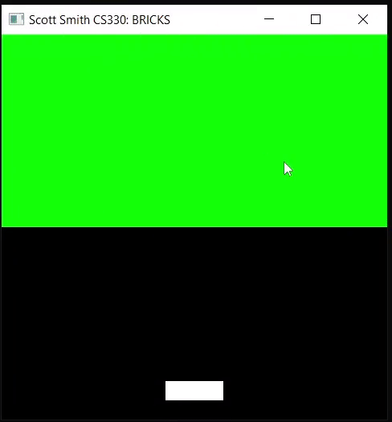

# BRICKS 
## A custom Breakout Game using C, C++ and OpenGL
To better understand coding collisions in OpenGL, I decided to implement a 2D video game like Breakout using the provided sample code.  Since the on-screen shapes are represented by their vertices, my first task was to simplify the boundaries of all bricks, circles, and screen edges into easily accessible variables which will simplify exchanging data among different functions later.  With shape boundaries assigned, I began implementing the physics required for the circles upon contact with the bricks, screen edges, and other circles.  Collision physics differ based on the direction of approach, so encapsulating these algorithms made it easier to reuse them in each shape interaction.  

To play BRICKS, the player uses the LEFT ARROW and RIGHT ARROW keys to manipulate the movement of the paddle at the bottom of the screen.  Pressing the X key releases a circle into the playing field and can only be used when there are no circles on the screen.  The objective of the game is to destroy all the bricks and each brick takes a total of two hits to destroy.  Real-world physics are applied to each circle when it collides with a brick.  When a player destroys a brick, another circle is released into the playing field.  The maximum number of circles a player can use on-screen at one time is six.  If a circle collides with another circle, both circles bounce off each other using real-world physics and are each assigned a randomized color value.  If the circles collide with the left, top, or right edges of the screen, they will bounce off the edge using real-world physics.  If the circle falls below the bottom edge of the screen past the player’s paddle, it is removed from the playing field.  Like Breakout or Pong, a player can control the direction of the circle’s movement based on the way they hit the circle.  The left side of the paddle will launch the circle diagonally upward to the left, the middle of the paddle will launch the circle directly upward, and the right side of the paddle will launch the circle diagonally upward to the right.  Have fun playing BRICKS!         

